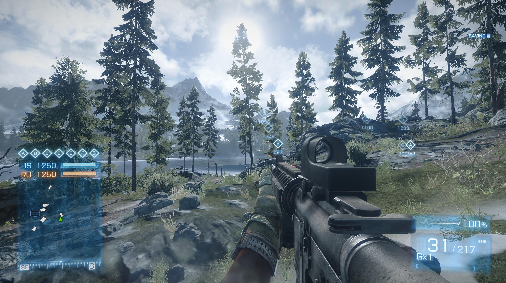
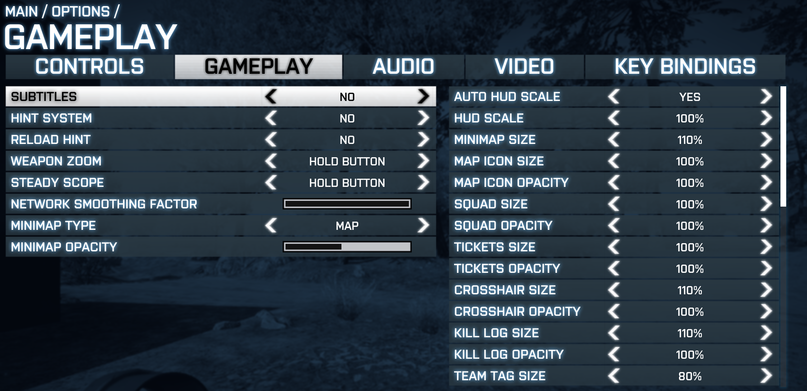

# bf3 hud fix

Battlefield 3 lays its Scaleform HUD out at a fixed 1280x720 once the screen is at least that big, so on resolutions starting at full HD and higher it looks tiny.
THis mod fixes that by scaling everything internally, with optional per-element scaling being accessed from in-game menu.

## Preview

In game, with the HUD scaled up:

The options in the **Gameplay** tab:

## Features

- **Auto HUD scale**: `min(width / 1280, height / 720)`, so the HUD keeps its 720p proportions at any resolution (due to the hardcoded layout)
- **Manual HUD scale**: want it bigger or smaller? set it exactly here
- **Per-element size** (50% - 300%, 10% steps):
  - minimap (with its background and compass)
  - minimap icons
  - squad list
  - tickets and objective bar
  - crosshair
  - kill log
  - nametags
  - ammo and health (including vehicle health and passenger list)
- Bottom-left widgets keep their place next to the resized minimap.
- The glyph cache is enlarged (1024 -> 2048) so scaled fonts stay sharp.

### Performance fixes

- **FPS drops**: the game's performance overlay asks Windows for system memory stats (`GetPerformanceInfo`) on every
  frame. This is mostly an issue on modern cpus. hudfix refreshes it once per second instead.
- **Chatbox lag**: chat lines never expire, the chat keeps up to 200 of them, and every new line resends the whole
  list to the UI. Once the chat fills up, each message stalls the game. hudfix caps the chat at 20 lines (credits [FlashHit](https://github.com/FlashHit)).

All options live in UI **Gameplay** tab. They are saved in your game profile next
to the rest of the gameplay settings (keys `HudFixAuto`, `HudFixScale`, `HudFixMinimap`, ...), so there is no extra
config file. Everything is applied like game settings.

## Download

No need to build it yourself: prebuilt DLLs are in the [`build`](build) folder.

- `Engine.BuildInfo_Win32_Retail_dll.dll` - hudfix
- `Engine_BuildInfo_orig.dll` - the game's original `Engine.BuildInfo_Win32_Retail_dll.dll`, renamed

Back up the game's `Engine.BuildInfo_Win32_Retail_dll.dll`, then copy both files into the Battlefield 3 folder
(e.g. `C:\Program Files\EA Games\Battlefield 3`) and overwrite. That's the whole install; the steps below are only
needed for a DLL you built yourself.

## Install

hudfix is a proxy for `Engine.BuildInfo_Win32_Retail_dll.dll`

1. In the Battlefield 3 folder, rename the original `Engine.BuildInfo_Win32_Retail_dll.dll` to
   `Engine_BuildInfo_orig.dll`. hudfix forwards `getBuildInfo` to it.
2. Copy the built `Engine.BuildInfo_Win32_Retail_dll.dll` into the Battlefield 3 folder.
3. Start the game. A log is written to `Documents\Battlefield 3\hudfix.log`.

To uninstall, delete the hudfix DLL and rename `Engine_BuildInfo_orig.dll` back.

Only the retail `bf3.exe` 1.6.0.0 is supported; every hook is a fixed address in that build.

## Build

Requirements: Visual Studio and [vcpkg](https://vcpkg.io) with MSBuild integration.
The only dependency is [MinHook](https://github.com/TsudaKageyu/minhook), installed from `vcpkg.json`
(`x86-windows-static`).

Open `hudfix.sln` and build **Release | Win32**

The DLL lands in `Release\`. Nothing copies it to the game folder for you.

## Few notes on the implementation
Menu code might be ghetto, because getting edits on scaleform is extremely painful...
